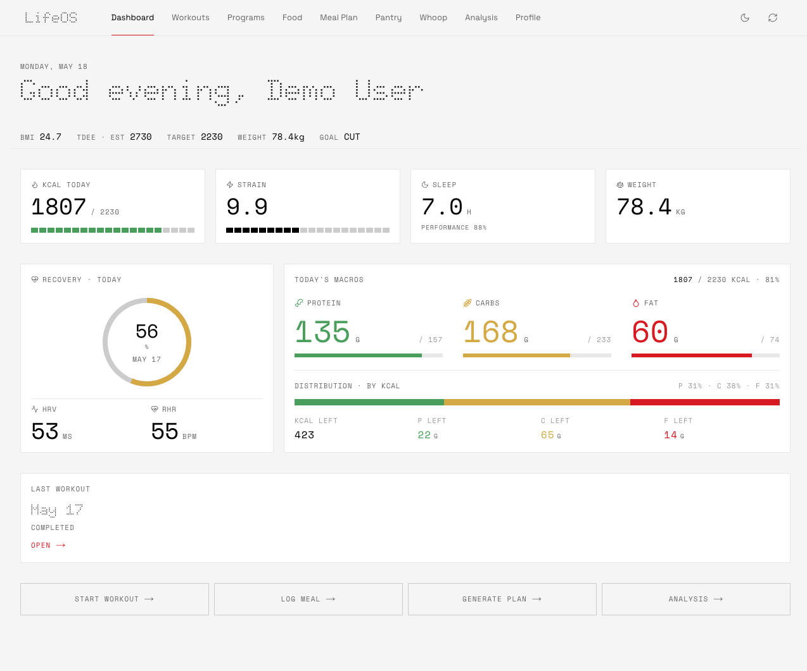
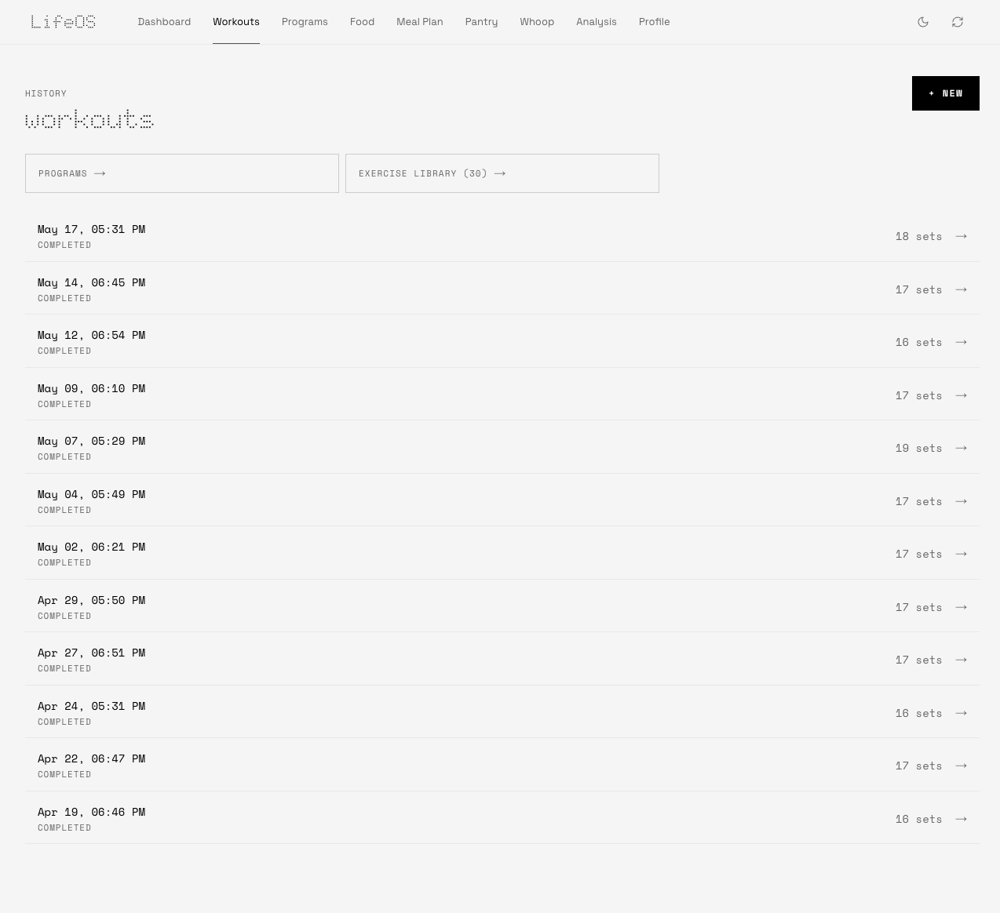
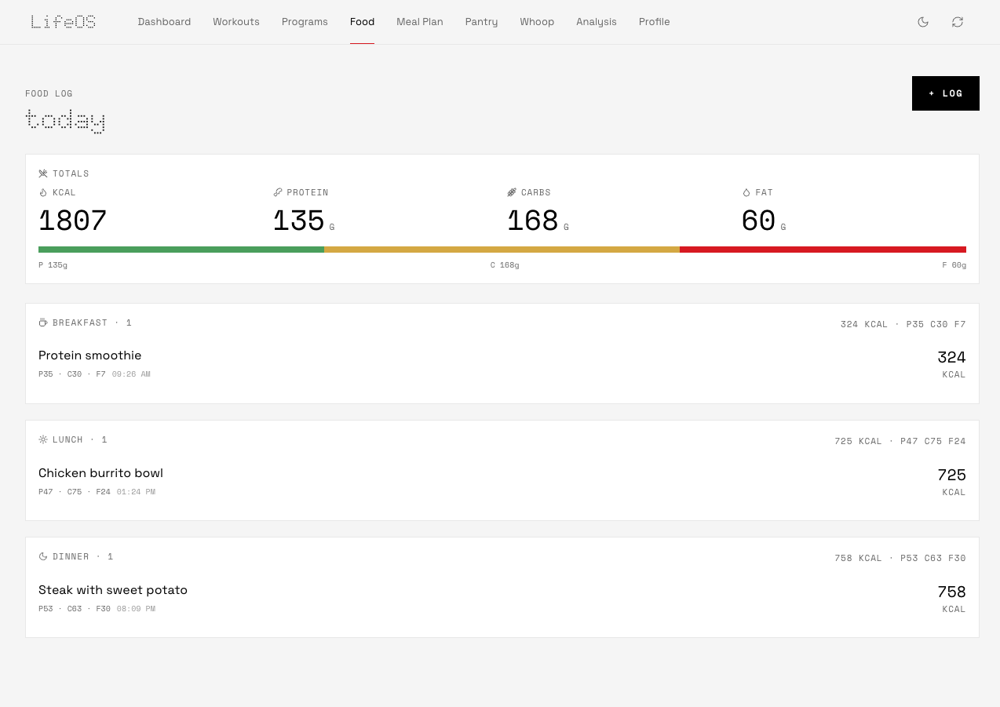
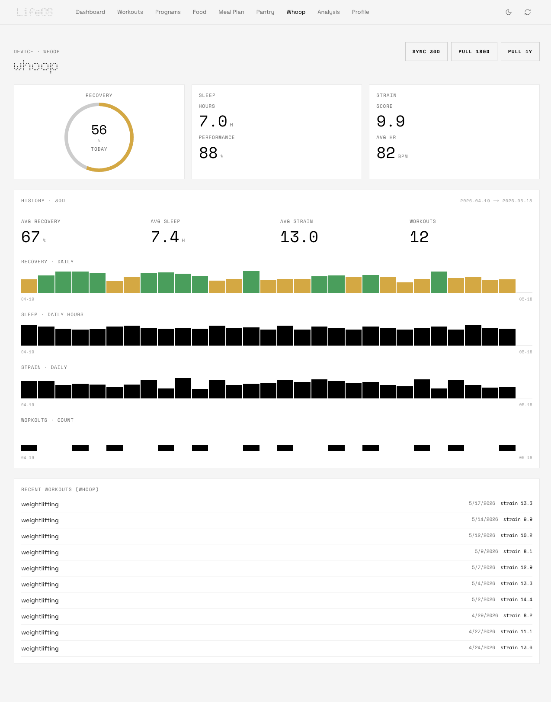
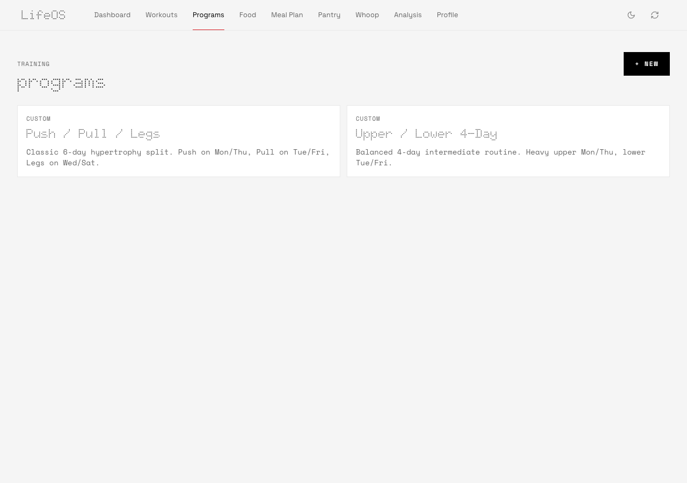
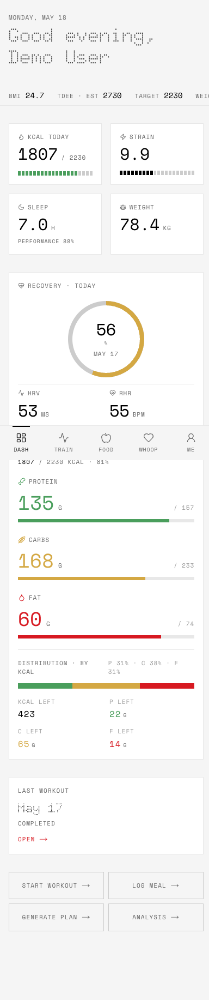
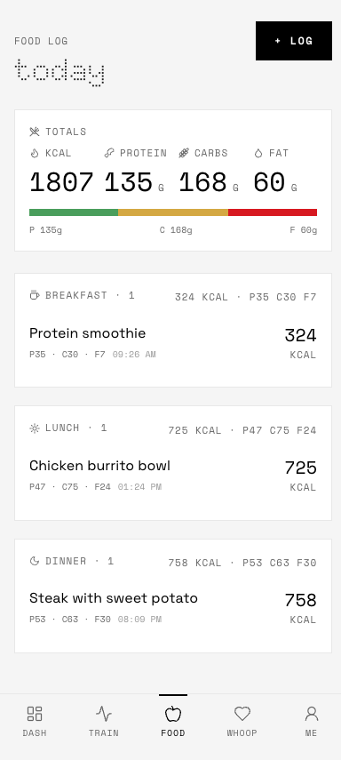

<div align="center">

# LifeOS

**Self-hosted personal life tracker — workouts, nutrition, Whoop, local AI photo calories, and diet planning.**

Local Qwen vision and NeMo/Wyoming speech services power the AI features; no external AI API key is needed.

[**▸ Live demo**](https://lifeos-demo-nu.vercel.app)  ·  data stays in your browser, nothing is sent server-side

[](LICENSE)




</div>

## Screens

| | |
|---|---|
|  |  |
| Workouts — log sets, rest timer, programs, 1RM tracking | Food log — manual or AI photo, daily macros vs target |
|  |  |
| Whoop — 30-day recovery / sleep / strain history | Programs — saved splits or AI-generated |

<details>
<summary>Mobile (the app is mobile-first)</summary>

| Dashboard | Food log |
|---|---|
|  |  |

</details>


---

LifeOS is the self-hosted personal OS I built for myself: log every workout, every meal, every Whoop recovery score, and let local AI handle the smart parts (photo-to-calories, meal planning, weekly insights, voice-to-meal transcription, and workout program generation).

It is intentionally **single-admin**: one user, one Postgres database, one Docker container, and local AI services on the LAN. Deploy it on `192.168.2.61:3000` and keep your fitness/nutrition data on your network. MIT licensed.

> The project is internally called `lifetracker` (package name, docker volumes, db name). The public/repo name is **LifeOS**.

## Local AI services

LifeOS uses these existing LAN services:

| Surface | Service | Purpose |
|---|---|---|
| Food photo, meal parsing, plans, programs, insights | Preloaded Qwen vision llama.cpp at `http://192.168.2.11:8081/v1` | OpenAI-compatible text and vision requests |
| Voice → meal log | Token-protected HTTP bridge at `http://192.168.2.61:10202` | Forwards audio to the existing NeMo/Wyoming ASR service at `192.168.2.61:10300` |

The configured llama.cpp model id is `/home/dogda/Documents/LLM_Runners/Qwen3.8-27B-Q3_K_M.gguf`. Existing TTS at `192.168.2.61:10201` is separate; LifeOS does not start, reconfigure, or require it. No external AI API key is needed.

Meal-text parsing performs at most one DuckDuckGo HTML search (up to five
results and 6,000 characters). Results are marked as untrusted reference
context, never executed, and a search failure still returns a parse with
`search_used: false`.

## Features

| | |
|---|---|
| 🏋️ **Workouts** | 1,324 exercises (en/tr) from the public `exercises-dataset`; create programs, log sets/reps/weight with RPE, rest timer, last-time overlay, Epley 1RM tracking |
| 🍳 **Food** | Manual log + AI photo estimate + voice transcription. Daily macros, kcal targets vs actuals |
| 🥗 **Plan & Shop** | AI-generated 3–14 day meal plans factoring goal, liked/disliked/allergy preferences, pantry inventory, and recently-eaten meals. Shopping list auto-subtracts pantry |
| ⌚ **Whoop** | OAuth2 connect, full sync (recovery, sleep, strain, workouts, body measurement), HMAC webhook, daily safety-net cron |
| 🧮 **Analysis** | Weight 90d · kcal 14d · recovery 30d · workout volume 30d. AI weekly insights |
| 🔐 **Auth** | Single admin, argon2id hash, sealed httpOnly cookie, 1-year expiry |
| 🎨 **UI** | Nothing-design aesthetic — Doto/Space Grotesk/Space Mono, OLED black, dot-matrix accents. Mobile-first with bottom nav + safe-area insets |

## Quick start (local)

Requires **Node 20+**, **pnpm**, and **Docker** (for Postgres).

```bash
git clone https://github.com/egebese/lifeos.git
cd lifeos

cp .env.example .env
# Edit at minimum:
#   SESSION_SECRET   → openssl rand -base64 64
#   ADMIN_EMAIL      → your email
#   ADMIN_PASSWORD   → first-boot password (change from /profile after login)
#   ASR_HTTP_TOKEN   → the same token configured for the ASR HTTP bridge
```

### Option A — full Docker stack (fastest)

```bash
docker compose up --build
# → migrate → bootstrap admin → seed 1,324 exercises → seed templates → next start
# Open http://192.168.2.61:3000  ·  login with ADMIN_EMAIL / ADMIN_PASSWORD
```

### Option B — dev mode (hot reload)

```bash
docker compose up -d db          # just Postgres
pnpm install
pnpm db:migrate
pnpm bootstrap:admin
pnpm seed:exercises              # ~1,324 records, ~30s, needs internet
pnpm dev                         # http://localhost:3000
```

## Environment variables

| Var | Required | Purpose |
|---|---|---|
| `DATABASE_URL` | ✅ | Postgres connection string |
| `SESSION_SECRET` | ✅ | 64-byte base64 (`openssl rand -base64 64`) for `iron-session` |
| `ADMIN_EMAIL` | ✅ | Bootstraps the single admin account on first boot |
| `ADMIN_PASSWORD` | ✅ | First-boot password; rotate it from `/profile` immediately after first login |
| `LLAMA_CPP_BASE_URL` | ✅ (deployment) | Preloaded llama.cpp API: `http://192.168.2.11:8081/v1` |
| `LLAMA_CPP_MODEL` | ✅ (deployment) | Exact Qwen model id: `/home/dogda/Documents/LLM_Runners/Qwen3.8-27B-Q3_K_M.gguf` |
| `ASR_HTTP_URL` | ✅ (deployment) | ASR bridge: `http://192.168.2.61:10202` |
| `ASR_HTTP_TOKEN` | ✅ | Shared secret for the ASR HTTP bridge; keep it out of Git and logs |
| `WHOOP_CLIENT_ID` | optional | From [developer.whoop.com](https://developer.whoop.com) |
| `WHOOP_CLIENT_SECRET` | optional | OAuth client secret |
| `WHOOP_REDIRECT_URI` | optional | `https://yourdomain.com/api/whoop/callback` |
| `WHOOP_WEBHOOK_SECRET` | optional | Only if you set a custom webhook secret in the Whoop portal |
| `NEXT_PUBLIC_APP_URL` | ✅ (deployment) | Public origin; use `http://192.168.2.61:3000` for this deployment |
| `ENABLE_CRON` | optional | `1` to enable background jobs in the Node process |
| `TZ` | optional | Defaults to `Europe/Istanbul`; set yours |
| `UPLOADS_DIR` | optional | Defaults to `./uploads` locally, `/data/uploads` in Docker |

## Architecture

```
┌──────────────────────────────────────────────────────────────┐
│  Next.js 15 (App Router, RSC, TypeScript strict)             │
│  └─ app/(app)/*    UI routes (mobile-first, Nothing design)  │
│  └─ app/api/*      REST handlers                             │
│                                                              │
│  lib/ai/client.ts  ──────────────►  llama.cpp                │
│    chat()                            Qwen3.8-27B              │
│    vision()                          Qwen vision              │
│    transcribeAudio()  ───────────►  ASR HTTP bridge           │
│                                                              │
│  lib/auth         iron-session + argon2id                    │
│  lib/whoop        OAuth2 + HMAC webhook + sync               │
│  lib/nutrition    macro math, BMR/TDEE, Epley 1RM            │
│                                                              │
│  Drizzle ORM  ────────────────►  PostgreSQL 16               │
│  node-cron    ────────────────►  daily Whoop safety-net      │
└──────────────────────────────────────────────────────────────┘
```

## Deploy on `192.168.2.61`

1. Copy `.env.example` to `.env`, generate a random `SESSION_SECRET`, set a non-default `ADMIN_PASSWORD`, and keep the example values for `LLAMA_CPP_BASE_URL`, `LLAMA_CPP_MODEL`, `ASR_HTTP_URL`, and `NEXT_PUBLIC_APP_URL`. This plain-HTTP LAN deployment uses `SESSION_COOKIE_SECURE=false`; set it to `true` when HTTPS terminates in front of LifeOS.
2. Install ffmpeg on the host: `sudo apt-get install -y ffmpeg`.
3. Install and enable the bridge as a user service:

   ```bash
   cd "$HOME/lifeos"
   loginctl enable-linger "$USER"
   mkdir -p "$HOME/.config/systemd/user"
   cp infra/asr-http/lifeos-asr-http.service "$HOME/.config/systemd/user/"
   umask 077
   token="$(openssl rand -hex 32)"
   printf 'ASR_HTTP_TOKEN=%s\n' "$token" > "$HOME/lifeos/asr-http.env"
   sed -i "s/^ASR_HTTP_TOKEN=.*/ASR_HTTP_TOKEN=$token/" .env
   unset token
   chmod 600 "$HOME/lifeos/asr-http.env" .env
   systemctl --user daemon-reload
   systemctl --user enable --now lifeos-asr-http.service
   ```
4. Confirm the preloaded Qwen service is reachable at `192.168.2.11:8081` and the bridge can reach NeMo/Wyoming at `192.168.2.61:10300`:

   ```bash
   curl -fsS http://192.168.2.11:8081/v1/models
   command -v ffmpeg
   systemctl --user is-active lifeos-asr-http.service
   ```

5. Run `docker compose up -d --build`. The Compose stack keeps Postgres data in `lt_pg`, uploads in `lt_uploads` mounted at `/data/uploads`, and the web app on port `3000`.
6. Open `http://192.168.2.61:3000`, log in with `ADMIN_EMAIL` and the first-boot `ADMIN_PASSWORD`, then rotate the password from `/profile` immediately.
7. For Whoop's daily safety-net sync, set `ENABLE_CRON=1`; keep `TZ=Europe/Istanbul` or set the deployment's IANA timezone. Configure the existing `WHOOP_*` variables only if Whoop is enabled.

The bridge and the existing TTS service at `192.168.2.61:10201` are host services, not Compose services. LifeOS does not restart or reconfigure them. No external AI API key is needed.

After provisioning the bridge, verify it without exposing the token:

```bash
command -v ffmpeg
systemctl --user is-enabled lifeos-asr-http.service
curl -fsS -H "X-ASR-Token: $ASR_HTTP_TOKEN" http://192.168.2.61:10202/health
```

## Tech

- **Runtime** — Next.js 15 App Router · React 19 · TypeScript strict · Tailwind v4
- **Database** — PostgreSQL 16 · Drizzle ORM 0.36
- **AI** — OpenAI-compatible local llama.cpp Qwen vision model plus the local ASR HTTP bridge
- **Auth** — `iron-session` (sealed httpOnly cookies) · `@node-rs/argon2`
- **UI** — `recharts` charts · `lucide-react` icons · `vaul` drawers · custom Nothing-design system
- **Jobs** — `node-cron` (Whoop daily safety-net)
- **Package manager** — pnpm 9.15

## Contributing

PRs welcome! See [CONTRIBUTING.md](CONTRIBUTING.md) for dev setup, code conventions, and what kinds of changes are in/out of scope.

Note that LifeOS is intentionally **single-user**. If you want multi-tenant SaaS-style auth, please open an issue first — that direction will likely live in a fork.

## Security

If you find a security issue, **do not open a public issue**. See [SECURITY.md](SECURITY.md) for disclosure instructions.

## Data attribution

Exercise dataset (1,324 records with images + GIFs) is from [`hasaneyldrm/exercises-dataset`](https://github.com/hasaneyldrm/exercises-dataset). It is provided for educational use only — media is referenced directly from the upstream raw URLs and not redistributed in this repo. Verify license alignment before commercial use.

Nothing-style visual language inspired by the [Nothing Design Skill](https://github.com/dominikmartn/nothing-design-skill) (Swiss + industrial). Fonts: Doto, Space Grotesk, Space Mono — all open-source.

## License

MIT — see [LICENSE](LICENSE).

Built with ❤️ by [@egebese](https://github.com/egebese).
